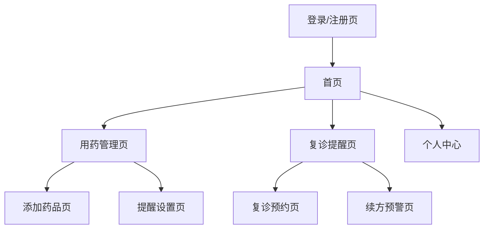

## 1. 产品概述
「慢病用药小管家」是一款专为慢性病患者设计的网页应用，解决患者线上复诊开药后忘记服药、重复购药等问题。产品提供从问诊到续方的全链条用药管理服务，帮助用户建立科学的个人用药计划并设置智能复诊提醒。

目标用户为需要长期服药的慢性病患者，通过数字化管理提升用药依从性，减少因用药不规范导致的健康风险。

## 2. 核心功能

### 2.1 用户角色
| 角色 | 注册方式 | 核心权限 |
|------|----------|----------|
| 患者用户 | 手机号+验证码注册 | 创建用药计划、设置提醒、记录服药情况、查看复诊提醒 |
| 家属用户 | 邀请码绑定患者账号 | 查看患者用药情况、协助提醒服药 |

### 2.2 功能模块
慢病用药小管家包含以下核心页面：
1. **首页**：用药概览、今日服药清单、快速添加用药
2. **用药管理页**：用药计划制定、药品信息录入、服药提醒设置
3. **复诊提醒页**：复诊计划管理、医生预约提醒、处方续期预警
4. **个人中心**：用户信息管理、家属绑定、用药数据统计

### 2.3 页面详情
| 页面名称 | 模块名称 | 功能描述 |
|----------|----------|----------|
| 首页 | 用药概览 | 显示当前进行中的用药计划数量、今日待服药次数、本周服药完成率 |
| 首页 | 今日服药清单 | 按时间顺序展示今日所有待服药信息，包括药品名称、剂量、服药时间，支持一键标记已服用 |
| 首页 | 快速添加用药 | 提供扫码添加、手动输入两种方式快速录入新药品信息 |
| 用药管理页 | 用药计划制定 | 创建个性化用药方案，设置药品名称、规格、剂量、服药频次、疗程周期 |
| 用药管理页 | 服药提醒设置 | 自定义提醒时间、提醒方式（站内消息/短信）、提醒音效，支持设置提前提醒时间 |
| 用药管理页 | 药品信息录入 | 录入药品基本信息（名称、规格、生产厂家）、上传药品包装照片、设置库存数量预警 |
| 复诊提醒页 | 复诊计划管理 | 创建复诊日程，选择复诊医院、科室、医生，设置复诊前提醒时间 |
| 复诊提醒页 | 处方续期预警 | 根据药品剩余量自动计算续药时间，提前7天发送续方提醒 |
| 复诊提醒页 | 医生预约提醒 | 同步复诊预约信息，提供预约时间、地点导航功能 |
| 个人中心 | 用户信息管理 | 编辑个人基本信息、疾病标签、过敏史记录 |
| 个人中心 | 家属绑定 | 生成邀请码供家属扫码绑定，设置家属查看权限范围 |
| 个人中心 | 用药数据统计 | 展示服药依从性趋势图、药品使用统计、复诊记录历史 |

## 3. 核心流程
用户首次使用产品时，需完成注册并填写基础疾病信息。随后可创建首个用药计划，系统会根据药品信息自动生成服药提醒。当药品库存不足或接近复诊时间时，系统会主动推送提醒消息。

主要用户操作流程：
1. 新用户注册 → 完善疾病信息 → 创建用药计划 → 设置提醒 → 日常服药打卡
2. 现有用户登录 → 查看今日服药任务 → 标记服药状态 → 查看复诊提醒 → 预约续方

## 4. 用户界面设计

### 4.1 设计风格
- **主色调**：医疗蓝（#1890FF）搭配健康绿（#52C41A），营造专业可信赖的医疗氛围
- **按钮样式**：圆角矩形设计，主要操作按钮采用渐变色突出显示
- **字体规范**：主标题18px加粗，正文14px常规，辅助文字12px灰色
- **布局风格**：卡片式布局，信息层级清晰，重要功能置于首屏显眼位置
- **图标风格**：采用线性医疗图标，简洁易懂，符合医疗产品调性

### 4.2 页面设计概览
| 页面名称 | 模块名称 | UI元素 |
|----------|----------|--------|
| 首页 | 用药概览 | 顶部统计卡片采用蓝白渐变背景，数据显示使用大字号突出，配合环形进度条展示完成率 |
| 首页 | 今日服药清单 | 时间轴式布局，每个药品卡片显示药品图标、名称、剂量，已服用项显示绿色勾选标记 |
| 用药管理页 | 用药计划列表 | 表格形式展示所有用药计划，支持按状态筛选，每行显示药品缩略图、关键信息 |
| 复诊提醒页 | 复诊日历 | 月历视图展示复诊安排，临近复诊日期显示橙色高亮，支持点击查看详情 |

### 4.3 响应式设计
采用桌面端优先设计策略，确保在PC端有最佳体验。同时适配平板和手机端：
- 平板端：保持核心功能完整，优化触控操作区域大小
- 手机端：采用底部导航栏，重要功能置于单手操作区域，支持扫码快速添加药品