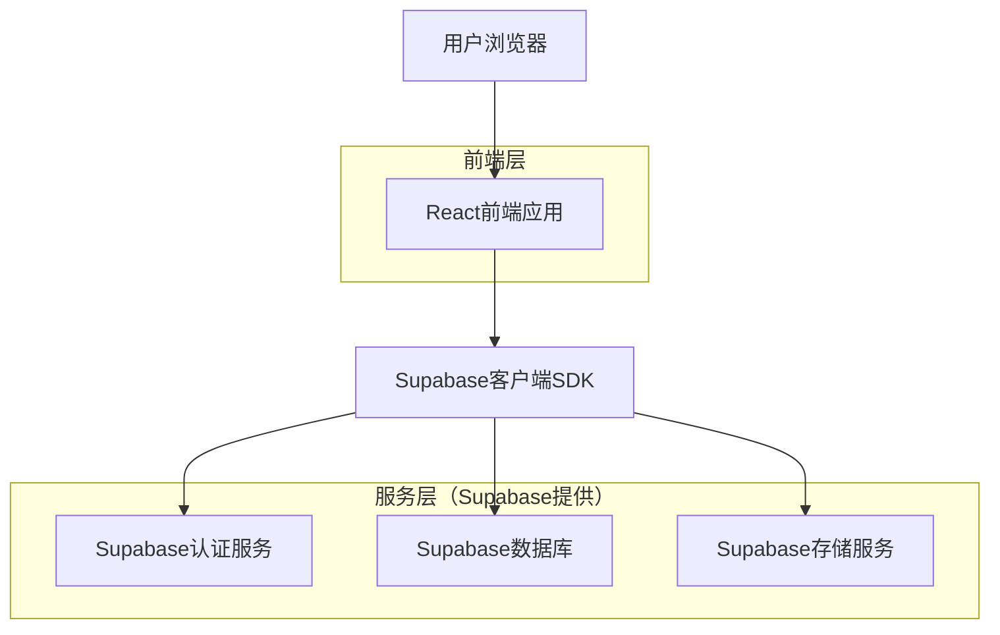
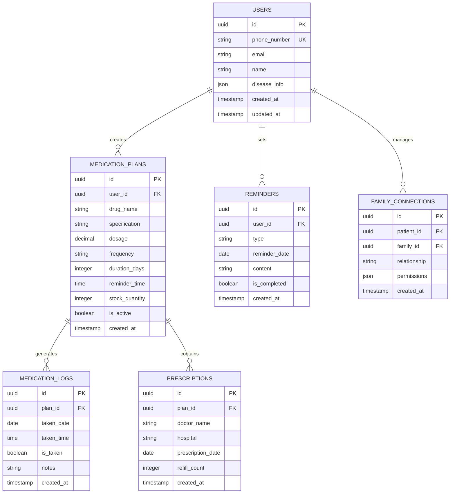

## 1. 架构设计



## 2. 技术描述

- **前端框架**: React@18 + TypeScript + Vite
- **UI组件库**: Ant Design@5 + 自定义医疗主题
- **状态管理**: React Context + useReducer
- **初始化工具**: vite-init
- **后端服务**: Supabase（一体化BaaS平台）
- **数据库**: Supabase PostgreSQL
- **身份认证**: Supabase Auth（支持手机号验证码登录）
- **文件存储**: Supabase Storage（药品图片存储）
- **实时功能**: Supabase Realtime（用药提醒推送）

## 3. 路由定义

| 路由路径 | 页面用途 |
|----------|----------|
| / | 首页，展示用药概览和今日服药清单 |
| /login | 登录页，支持手机号+验证码登录 |
| /register | 注册页，完善个人信息和疾病标签 |
| /medication | 用药管理页，管理所有用药计划 |
| /medication/add | 添加药品页，录入新药品信息 |
| /medication/edit/:id | 编辑用药计划页，修改现有用药方案 |
| /reminder | 复诊提醒页，管理复诊和续方提醒 |
| /reminder/appointment | 复诊预约页，设置复诊日程 |
| /profile | 个人中心，用户信息管理和数据统计 |
| /profile/family | 家属管理页，邀请和管理家属账号 |

## 4. 数据模型

### 4.1 实体关系图



### 4.2 数据定义语言

用户表（users）
```sql
-- 创建用户表
CREATE TABLE users (
    id UUID PRIMARY KEY DEFAULT gen_random_uuid(),
    phone_number VARCHAR(20) UNIQUE NOT NULL,
    email VARCHAR(255),
    name VARCHAR(100) NOT NULL,
    disease_info JSONB DEFAULT '{}',
    created_at TIMESTAMP WITH TIME ZONE DEFAULT NOW(),
    updated_at TIMESTAMP WITH TIME ZONE DEFAULT NOW()
);

-- 创建索引
CREATE INDEX idx_users_phone ON users(phone_number);
```

用药计划表（medication_plans）
```sql
-- 创建用药计划表
CREATE TABLE medication_plans (
    id UUID PRIMARY KEY DEFAULT gen_random_uuid(),
    user_id UUID REFERENCES users(id) ON DELETE CASCADE,
    drug_name VARCHAR(200) NOT NULL,
    specification VARCHAR(100),
    dosage DECIMAL(10,2) NOT NULL,
    frequency VARCHAR(50) NOT NULL,
    duration_days INTEGER DEFAULT 30,
    reminder_time TIME,
    stock_quantity INTEGER DEFAULT 0,
    is_active BOOLEAN DEFAULT true,
    created_at TIMESTAMP WITH TIME ZONE DEFAULT NOW()
);

-- 创建索引
CREATE INDEX idx_medication_plans_user_id ON medication_plans(user_id);
CREATE INDEX idx_medication_plans_active ON medication_plans(is_active);
```

用药记录表（medication_logs）
```sql
-- 创建用药记录表
CREATE TABLE medication_logs (
    id UUID PRIMARY KEY DEFAULT gen_random_uuid(),
    plan_id UUID REFERENCES medication_plans(id) ON DELETE CASCADE,
    taken_date DATE NOT NULL,
    taken_time TIME,
    is_taken BOOLEAN DEFAULT false,
    notes TEXT,
    created_at TIMESTAMP WITH TIME ZONE DEFAULT NOW()
);

-- 创建索引
CREATE INDEX idx_medication_logs_plan_id ON medication_logs(plan_id);
CREATE INDEX idx_medication_logs_date ON medication_logs(taken_date);
```

提醒表（reminders）
```sql
-- 创建提醒表
CREATE TABLE reminders (
    id UUID PRIMARY KEY DEFAULT gen_random_uuid(),
    user_id UUID REFERENCES users(id) ON DELETE CASCADE,
    type VARCHAR(50) NOT NULL,
    reminder_date DATE NOT NULL,
    content TEXT,
    is_completed BOOLEAN DEFAULT false,
    created_at TIMESTAMP WITH TIME ZONE DEFAULT NOW()
);

-- 创建索引
CREATE INDEX idx_reminders_user_id ON reminders(user_id);
CREATE INDEX idx_reminders_date ON reminders(reminder_date);
```

### 4.3 Supabase权限设置

```sql
-- 匿名用户权限（仅注册）
GRANT INSERT ON users TO anon;

-- 认证用户权限（完整访问）
GRANT ALL PRIVILEGES ON medication_plans TO authenticated;
GRANT ALL PRIVILEGES ON medication_logs TO authenticated;
GRANT ALL PRIVILEGES ON reminders TO authenticated;
GRANT ALL PRIVILEGES ON family_connections TO authenticated;
GRANT ALL PRIVILEGES ON prescriptions TO authenticated;

-- 行级安全策略（RLS）
ALTER TABLE medication_plans ENABLE ROW LEVEL SECURITY;
CREATE POLICY "用户只能查看自己的用药计划" ON medication_plans
    FOR ALL TO authenticated
    USING (auth.uid() = user_id);

ALTER TABLE medication_logs ENABLE ROW LEVEL SECURITY;
CREATE POLICY "用户只能查看自己的用药记录" ON medication_logs
    FOR ALL TO authenticated
    USING (EXISTS (
        SELECT 1 FROM medication_plans 
        WHERE medication_plans.id = medication_logs.plan_id 
        AND medication_plans.user_id = auth.uid()
    ));
```

## 5. 核心功能实现要点

### 5.1 用药提醒机制
- 使用Supabase Edge Functions实现定时任务
- 结合用户设置的reminder_time发送个性化提醒
- 支持浏览器通知、短信等多种提醒方式

### 5.2 服药依从性统计
- 通过medication_logs计算实际服药率
- 使用PostgreSQL的日期函数分析服药规律
- 生成可视化图表展示用药趋势

### 5.3 库存预警算法
- 根据用药频率和stock_quantity计算剩余天数
- 提前7天自动创建续方提醒
- 结合prescriptions表的refill_count管理续方次数